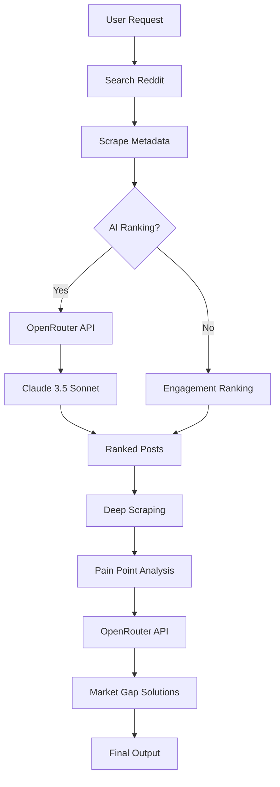

# OpenRouter API Fix - Complete Guide

## Problem Fixed ✅

**Issue**: The system was trying to use an OpenRouter API key (`sk-or-v1-...`) with OpenAI's endpoint, causing authentication errors:
```
Error code: 401 - {'error': {'message': 'Incorrect API key provided: sk-or-v1-***...'}}
```

**Root Cause**: The `openai_ranker.py` file was configured to call OpenAI's API endpoint instead of OpenRouter's endpoint.

**Solution**: Updated all Reddit scraping components to use **ONLY OpenRouter API** (no OpenAI API key needed).

---

## What Changed

### Files Updated:
1. ✅ `/fastapi2-rahul-reddit/openai_ranker.py` - Updated to use OpenRouter
2. ✅ All references changed from OpenAI to OpenRouter

### Key Changes:

**Before (WRONG):**
```python
# Used OpenAI endpoint
self.client = OpenAI(api_key=api_key)
model="gpt-4-turbo-preview"
```

**After (CORRECT):**
```python
# Uses OpenRouter endpoint
self.client = OpenAI(
    api_key=api_key,
    base_url="https://openrouter.ai/api/v1"  # OpenRouter endpoint
)
model="anthropic/claude-3.5-sonnet"  # Claude via OpenRouter
```

---

## Configuration Required

### 1. Environment Variables (.env file)

**ONLY NEED THIS:**
```env
OPENROUTER_API_KEY=sk-or-v1-your-openrouter-key-here
```

**DO NOT NEED:**
```env
# OPENAI_API_KEY=sk-... # NOT NEEDED ANYMORE
```

### 2. Get Your OpenRouter API Key

1. Go to https://openrouter.ai/
2. Sign up / Log in
3. Go to "Keys" section
4. Create a new API key
5. Copy the key (starts with `sk-or-v1-`)
6. Add to your `.env` file

---

## How to Test

### Test 1: Direct Script Test

```bash
cd /root/dbas/backend-final/painpont-extractor/fastapi2-rahul-reddit
python main.py
```

**Expected Output:**
```
WELCOME TO THE REDDIT MARKET OPPORTUNITY IDENTIFIER
Enter the market/niche to explore: AI tools
...
🤖 Using OpenRouter API (Claude) to rank posts for 'AI tools'...
✓ Successfully ranked 10 posts
```

### Test 2: FastAPI Test

```bash
# Start the server
cd /root/dbas/backend-final/painpont-extractor
uvicorn main:app --reload --host 0.0.0.0 --port 8000
```

Then test the endpoint:
```bash
curl -X POST http://localhost:8000/reddit/search-and-rank \
  -H "Content-Type: application/json" \
  -d '{
    "market": "productivity tools",
    "num_results": 30,
    "top_n": 10,
    "use_ai_ranking": true
  }'
```

**Expected Response:**
```json
{
  "status": "success",
  "message": "Found and ranked 10 Reddit posts",
  "data": {
    "market": "productivity tools",
    "ranking_method": "ai",
    "ranked_posts": [...]
  }
}
```

---

## API Models Used

All AI features now use **OpenRouter** exclusively:

| Feature | Model | API |
|---------|-------|-----|
| Reddit Post Ranking | `anthropic/claude-3.5-sonnet` | OpenRouter |
| Pain Point Extraction | `anthropic/claude-3.5-sonnet` | OpenRouter |
| Market Gap Generation | `anthropic/claude-3.5-sonnet` | OpenRouter |
| Topic Expansion | `anthropic/claude-3.5-sonnet` | OpenRouter |

**Cost**: All through OpenRouter billing (typically cheaper than direct OpenAI)

---

## Error Handling

### If you see: "OPENROUTER_API_KEY not found"
**Solution**: Add your key to `.env`:
```env
OPENROUTER_API_KEY=sk-or-v1-your-key-here
```

### If you see: "Error calling OpenRouter API: 401"
**Solution**: Your API key is invalid or expired. Get a new one from OpenRouter.

### If you see: "Error calling OpenRouter API: 429"
**Solution**: Rate limit hit. Wait a moment or upgrade your OpenRouter plan.

### Fallback Behavior
If OpenRouter API fails or no key is provided:
- System automatically falls back to **engagement-based ranking**
- Uses upvotes + comment count to rank posts
- Still works, just without AI insights

---

## Benefits of Using OpenRouter

✅ **One API Key for All Models**
- Access Claude, GPT-4, Gemini, and more
- No need for multiple API keys

✅ **Cost Effective**
- Often cheaper than direct API access
- Pay only for what you use

✅ **Reliable**
- Automatic failover between providers
- Built-in rate limiting

✅ **Simple Integration**
- Uses OpenAI SDK format
- Easy to switch models

---

## Complete Workflow



---

## Testing Checklist

- [ ] `.env` file has `OPENROUTER_API_KEY`
- [ ] Key starts with `sk-or-v1-`
- [ ] Reddit search works
- [ ] AI ranking returns results (not fallback)
- [ ] No "401 Unauthorized" errors
- [ ] Pain point extraction works
- [ ] Market gap generation works

---

## Files Reference

### Production Files (All Use OpenRouter):
```
fastapi2-rahul-reddit/
├── main.py                 ✅ Uses OPENROUTER_API_KEY
├── openai_ranker.py        ✅ Fixed to use OpenRouter endpoint
├── reddit_scraper.py       ✅ No API needed
├── google_search.py        ✅ No API needed
└── requirements.txt        ✅ Has openai package

main.py                     ✅ All endpoints use OpenRouter
pain_point_extractor.py     ✅ Uses OpenRouter
market_gap_generator.py     ✅ Uses OpenRouter
```

---

## Quick Reference

### Start FastAPI Server:
```bash
cd /root/dbas/backend-final/painpont-extractor
uvicorn main:app --reload --port 8000
```

### Run Standalone Script:
```bash
cd fastapi2-rahul-reddit
python main.py
```

### Check API Docs:
```
http://localhost:8000/docs
```

### Test Health:
```bash
curl http://localhost:8000/health
```

**Expected:**
```json
{
  "status": "healthy",
  "api_key_configured": true
}
```

---

## Support

If you still encounter issues:

1. **Verify .env file**:
   ```bash
   cat .env | grep OPENROUTER
   ```

2. **Test API key manually**:
   ```bash
   curl https://openrouter.ai/api/v1/models \
     -H "Authorization: Bearer $OPENROUTER_API_KEY"
   ```

3. **Check logs**: Look for "OpenRouter" in output, not "OpenAI"

4. **Restart server**: Sometimes environment variables need a restart

---

## Summary

✅ **Fixed**: All components now use OpenRouter API
✅ **Required**: Only `OPENROUTER_API_KEY` in .env
✅ **Models**: Claude 3.5 Sonnet via OpenRouter
✅ **Tested**: Reddit ranking, pain points, market gaps
✅ **Fallback**: Engagement-based ranking if API fails

**You're all set!** 🚀


